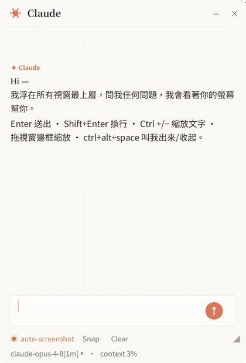
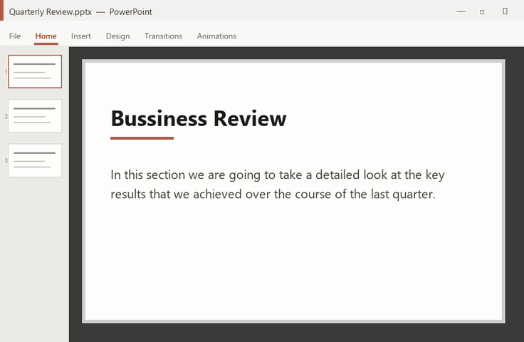

# Claude Overlay

<p align="center">
  <a href="https://docs.claude.com/en/docs/claude-code"></a>
  
  
  <a href="LICENSE"></a>
  <a href="https://github.com/shengyanlin/claude-overlay/stargazers"></a>
  <a href="https://github.com/hesreallyhim/awesome-claude-code"></a>
</p>

> ### Talk to Claude Code without ever leaving the app you're in — and let it actually *see* your screen.

<p align="center"><sub><b>Windows 10 / 11</b> only (for now) · runs on your existing Claude subscription — no API key</sub></p>

<p align="center">
  
</p>

**Claude Overlay** is a frameless, always-on-top chat window that floats over
everything you do. Ask a question, and Claude looks at your **real
screen** — every monitor — to answer. No copy-pasting error messages, no
describing what you're staring at, no alt-tabbing to a browser. And because it
runs the full [**Claude Code**](https://docs.claude.com/en/docs/claude-code) agent
under the hood, it doesn't just chat — it can read, edit, and run things for you,
right where you work. Point it at the slide deck, document, or spreadsheet you have
**open** and it can change the file you're looking at — you never have to tell it
where the file lives or even alt-tab away.

Best of all, it costs **nothing extra**: it drives **your own** `claude` CLI login,
so it uses your **existing Claude subscription — no API key, no metered billing.**

> ⭐ **If a screen-aware Claude that floats over your work sounds useful, star the repo** — it helps other people find it.

### ✨ Why you'll want it

- 👁️ **It sees what you see.** Auto-captures each monitor on every message and
  labels primary vs. secondary — just ask *"what's wrong here?"* and it looks.
- 🪟 **Never breaks your flow.** Always-on-top and frameless; it collapses to a
  tiny draggable orb when you're not using it (with a real Windows **taskbar
  button** to click it back), and drops a ✓ on the orb when a reply finishes
  while it's tucked away — so you know a task is done without expanding it.
- 🏷️ **Name each overlay; run several at once.** Click the title to name an
  overlay for the task it's on — the name rides under the orb when collapsed, so a
  row of orbs (one per task) stays tellable apart at a glance.
- 🧠 **A real agent that acts, not a chatbot.** Full Claude Code (Opus 4.8) — it
  edits files, runs commands, and can even reach into the app on your screen (say,
  fix the wording on your open slide, or build a model in your open Excel), not just
  answer questions.
- 💸 **No API key, no extra cost.** Runs on your existing Claude subscription.
- 🖼️ **Screenshots *and* pasted images.** It grabs your screen automatically on every
  message, or paste any image with **Ctrl+V** to ask about it.
- ⚡ **Live, polished UI.** Responses stream token-by-token with clean tool-call
  chips, an in-place model switcher, and a context-usage meter.
- 🎨 **Looks the part, crisp anywhere.** Styled after the Claude desktop app,
  DPI-aware on HiDPI displays, resizable from any edge, with live **Ctrl +/–** zoom.
- 🔒 **Local & private.** Runs entirely on your machine against your own login.

## Where a floating overlay wins

The CLI and the desktop app are perfect when you're already in a terminal or a chat
window. The overlay earns its place by floating over **whatever you're doing**, **seeing
it**, and **acting on it** — so it shines exactly where those can't:

- ✍️ **Edit what's right in front of you.** Don't just ask *about* the open
  document — ask it to *change* it. Fix a typo on the current slide, tighten a
  paragraph in your draft, fill a cell, or reword a heading. Because it's a full
  Claude Code agent with a shell, it can drive the app you already have open (e.g.
  via PowerShell/COM automation) to edit the file you're looking at — **no file
  path needed**. It works this out at run time rather than from a built-in
  integration, so it's not infallible: sanity-check important documents first
  (see the **Security note** near the end of this README).

<p align="center">
  
  <br><em>Ask it to fix the open slide — it edits the deck you already have open, no file path given.</em>
</p>

- 📊 **Build, not just edit.** Ask for a spreadsheet and it builds the real thing in your
  open Excel — sourced assumptions, live formulas, a top-down calculation, even a
  low/base/high sensitivity, laid out like a banker's model. One sentence in the overlay,
  a working model in the sheet.

<p align="center">
  
  <br><em>Ask in the overlay; it drives Excel to build the model — assumptions, formulas, and a sensitivity.</em>
</p>

- 🖥️ **Mid-presentation.** Stay in full-screen slideshow. Summon the overlay to
  fact-check a number, translate a term, or field an audience question on the spot —
  then dismiss it without ever leaving the deck.
- 🌐 **Reading in another language.** On a foreign-language page, PDF, or slide, ask
  it to translate or explain what's on screen, *in place* — no copy-pasting into a
  separate translator tab.
- 📄 **Skimming something long.** "TL;DR this", "what does it say about X?" — about the
  article, whitepaper, or PDF you're looking at, without selecting or pasting a word.
- 🧩 **Any GUI with no terminal.** A cryptic error dialog, a settings panel, a BI
  dashboard, a spreadsheet formula — point your screen at it and ask. It works over
  apps that have no command line and nothing to copy.
- 🖥️🖥️ **Across monitors.** It captures every screen, so ask it to reconcile the spec
  on one monitor against the figure or table on the other.
- 🎥 **On a call or screen-share.** A discreet, always-on-top helper to look things up
  about what's being shown — without alt-tabbing away from the meeting.

<p align="center">
  
  <br><em>Not using it? It collapses to an orb that floats out of the way — click to bring it back.</em>
</p>

## How it works

```
Overlay (Tkinter UI)  →  claude-agent-sdk  →  spawns the `claude` CLI  →  Anthropic
        ▲ screenshots (Pillow ImageGrab, one image per monitor)
```

- **UI** — Tkinter (ships with Python; no extra GUI runtime).
- **Brain** — `claude-agent-sdk` spawns your installed `claude` CLI as a subprocess
  and talks to it. It is **not** a direct API client, so the CLI is required.
- **Eyes** — Pillow `ImageGrab` snapshots **each monitor separately**; the prompt
  labels which is the **primary** vs **secondary** screen, and Claude reads each
  with its `Read` tool. The window hides itself during capture.

---

## Prerequisites

You need three things. The included **`setup.cmd`** handles #2 and #3 for you — it
auto-installs the Claude Code CLI if it's missing and installs the Python packages.

### 1. Windows 10 / 11
The app uses Win32 APIs (DPI awareness, rounded corners, multi-monitor capture),
so it currently runs **on Windows only**.

### 2. Claude Code CLI — installed *and logged in*
The overlay has no brain of its own; it drives the `claude` command line.

**Easiest:** just run **`setup.cmd`** (below) — it installs the CLI for you with the
official native installer if you don't already have it. To install it yourself:

- **Native installer — recommended, no Node.js** (PowerShell):
  ```powershell
  irm https://claude.ai/install.ps1 | iex
  ```
  (or `winget install Anthropic.ClaudeCode`). It auto-updates itself.
- **npm** (needs Node.js 18+): `npm install -g @anthropic-ai/claude-code`

**Log in** with your own Claude account (Pro/Max subscription — no API key needed):
run `claude auth login` (in PowerShell or CMD — not Git Bash) and follow the browser prompt once.

**Verify** — this must print a version number:
```
claude --version
```
If it says "command not found", the CLI isn't installed / on PATH yet.

### 3. Python 3.10+
**Install** from <https://www.python.org/downloads/> and tick
**"Add python.exe to PATH"** in the installer.

**Verify:**
```
python --version
```

---

## Install

Pick whichever you like — all three end with the overlay ready to run.

### 🖱️ One double-click — `setup.cmd` (recommended)

Get the repo, then double-click **`setup.cmd`**. It checks Python,
**auto-installs the `claude` CLI if it's missing** (and offers to log you in), and
installs the Python packages — so even a fresh machine is one double-click from ready.

```
git clone https://github.com/shengyanlin/claude-overlay.git
```
(or download the ZIP from the green **Code** button and unzip it.)

### ⚡ Let Claude install it (if you already have the CLI)

It's an agent — so it can set itself up. With the `claude` CLI already installed
(see [Prerequisites](#2-claude-code-cli--installed-and-logged-in)), run this from
wherever you want it to live:

```
claude "Set up Claude Overlay for me: clone https://github.com/shengyanlin/claude-overlay, make sure Python 3.10+ is installed (install it if missing), ensure pip is present (python -m ensurepip --upgrade), then run python -m pip install -r requirements.txt, then launch it with pythonw. Tell me when it's running."
```

Claude will ask before each step.

### 🛠️ By hand

```
git clone https://github.com/shengyanlin/claude-overlay.git
cd claude-overlay
python -m ensurepip --upgrade          # only needed if pip is missing; harmless otherwise
python -m pip install -r requirements.txt
```

This installs only the Python packages (`claude-agent-sdk`, `pillow`, `keyboard`) —
you still need the `claude` CLI installed and logged in (see Prerequisites). Use
`python -m pip` (not a bare `pip`): it works even when Python's `Scripts\` folder
isn't on PATH, and `ensurepip` bootstraps `pip` if your Python install shipped without it.

---

## Update

The overlay shows its version in the bottom status line (e.g. `v1.7.2`) and checks
GitHub for a newer release on startup — when one exists you'll see a 🔔 note and a `⬆`
next to the version. To upgrade:

### 🖱️ One double-click — `update.cmd` (recommended)

Double-click **`update.cmd`**. It runs `git pull`, refreshes the Python packages, and — if you
already have a Desktop shortcut — refreshes its icon to match the current version.

### 🛠️ By hand

```
cd claude-overlay
git pull
```

(Installed via **ZIP** instead of `git clone`? Re-download the latest ZIP from the green
**Code** button and unzip it over the folder — at minimum replace `claude_overlay.py`.)

> **Then restart the overlay.** It's a long-running process and does **not** reload
> while running — close it and re-open **`Start Claude Overlay.cmd`** for the update to
> take effect. (On a managed/enterprise machine, updating is what fixes the older
> versions that could hang on the first tool call.)
>
> Updated **by hand** (`git pull`) and the Desktop icon still looks old? Re-run
> **`Create Desktop Shortcut.cmd`** once — the shortcut is a machine-specific file that
> `git pull` can't refresh (`update.cmd` does this for you).

---

## Run

1. Make sure `claude --version` works and you've logged in (`claude auth login`).
2. Start it (any of):
   - Double-click **`Start Claude Overlay.cmd`** — launches with **no console window**.
   - `pythonw claude_overlay.py` — no console.
   - `python claude_overlay.py` — keeps a console open for logs (good for debugging).
3. The window appears. Type and hit **Enter** — it auto-captures your screen each
   message, so you can ask about whatever's in front of you right away.
4. Not using it? Hit **–** to collapse it to a small floating orb, and click the orb
   to expand it again.

### Put it on your Desktop (optional)

Double-click **`Create Desktop Shortcut.cmd`** to drop a **Claude Overlay** shortcut
— with the orb icon — on your Desktop, so you can launch it like any other app.

> Don't just drag `Start Claude Overlay.cmd` to your Desktop — it's a portable
> launcher that must stay next to `claude_overlay.py`. The shortcut points back to it
> in place, which is why it keeps working.

---

## Controls

| Action | How |
|---|---|
| Send message | `Enter` (or click the **↑** button) |
| New line | `Shift+Enter` |
| Stop a running reply | click **Stop** (the ↑ becomes ■ while busy) |
| Paste an image | **Ctrl+V** (click **📎** to clear) |
| Toggle auto-screenshot | **◉ / ○ Auto-shot** (orange = on) |
| Capture only the active window | **◉ / ○ Window-only** (orange = window-only; off = every monitor) |
| Show / hide in screen shares | **◉ / ○ Shareable** (orange = visible to Teams/Zoom/OBS; off = private, the default) |
| Switch model | click the **statusline** (`model ▾`) |
| Zoom text in / out | **Ctrl +** / **Ctrl −** (or **Ctrl + mouse-wheel**); **Ctrl 0** resets |
| New conversation | **Clear** |
| Compact the conversation (free up context) | **Compact** — summarizes older turns, keeps going |
| Copy a reply | click **⧉ Copy** under the message |
| Name this overlay | click the title (**Claude**) — handy with several open |
| Collapse to a Claude orb | **–**, or double-click the title bar |
| Expand from the orb | click the orb (drag it to move) |
| Quit | **✕** |
| Move | drag the title bar |
| Resize | drag **any edge or corner** (or the **◢** grip) |

---

## Configuration

All settings are constants at the top of `claude_overlay.py`:

- `MODEL` — defaults to `"opus"`, a **family alias for the latest Opus**, so a future
  Opus release is adopted automatically. Use `"opus[1m]"` for the 1M-context variant, or
  `"sonnet"` / `"haiku"` — every alias tracks the newest model of its family, and the
  in-app switcher lists them all (the statusline shows the concrete version each alias
  resolved to, e.g. `claude-opus-4-8`). Don't use `None`: the Agent SDK resolves `None`
  to an older model, not the CLI's interactive default.
- `PERMISSION_MODE` — `"bypassPermissions"` by default (see security note below).
  Use `"acceptEdits"`, `"default"`, or `"plan"` to add confirmation / read-only.
- `WORKING_DIR` — folder Claude operates in (default: your home directory).
- `THEME` — `"light"` (warm paper) or `"dark"`.
- `TASKBAR_BUTTON` — `True` (default) gives the frameless window a real, clickable
  Windows taskbar button; `False` for the pure no-taskbar floating overlay.
- `SKILLS` — which Agent SDK skills to expose: `"all"`, a list of names, or `None`.
- `STRICT_MCP_CONFIG` — `True` (default) keeps the overlay lean by **not** inheriting
  the MCP servers from your `~/.claude` config; set `False` to expose them here
  (handier, but their tool schemas cost a lot of context).
- `SHOT_FORMAT` / `SHOT_JPEG_QUALITY` (or the `CLAUDE_OVERLAY_SHOT_FORMAT` /
  `CLAUDE_OVERLAY_SHOT_JPEG_QUALITY` env vars) — screenshot payload: `"auto"` keeps
  the smaller of PNG/JPEG per capture; `"png"`/`"jpeg"` force one; JPEG quality 50–95.
- `SHOT_SCOPE` (or the `CLAUDE_OVERLAY_SHOT_SCOPE` env var) — what a screenshot covers:
  `"screens"` (default) captures every monitor, one image each; `"window"` captures
  **only the active window** — more private and cheaper in vision tokens, but Claude
  can't see anything outside it. This is just the startup default; flip it live with
  the **◉ / ○ Window-only** status-bar toggle. While you're typing *in* the overlay,
  "active" means the window you were working in before it (tracked automatically), and
  when no usable window exists (fresh launch, desktop focused, window minimized) it
  falls back to full-screen capture rather than sending nothing.
- `AUTO_SCREENSHOT_DEFAULT`, `FONT_SANS/SERIF/MONO`, `CORNER_RADIUS`, `ORB_SIZE`,
  `HIDE_SCREENSHOT_TOOL`, `WINDOW_ALPHA` — see inline comments.

## ⚠️ Security note

The default `PERMISSION_MODE = "bypassPermissions"` makes this a **fully
autonomous agent**: Claude can edit files and run commands in `WORKING_DIR`
**without asking**, and it can see your screen. Combined with screen vision, that
also lets it **act on the app you have open** — e.g. edit the document or slide
deck on your screen via Windows/COM automation, and (with autosave on) persist
those edits straight to the original file. That's the magic, but it also means it
can change important documents without a confirmation step — double-check before
you let it loose on anything you can't afford to lose. If you don't want that, set
`PERMISSION_MODE` to `"acceptEdits"` (asks before edits), `"default"` (asks before
most actions), or `"plan"` (read-only) before running.

## Contributing

Issues and PRs are welcome — bug reports, feature ideas, and especially help making
it **cross-platform** (macOS/Linux capture + windowing). See
[CONTRIBUTING.md](CONTRIBUTING.md) for how to get started.

## License

[MIT](LICENSE) © shengyanlin

---

<p align="center">
  <sub>Built with Claude Code. If it earned a spot on your screen, leave a ⭐ — it genuinely helps.</sub>
</p>
